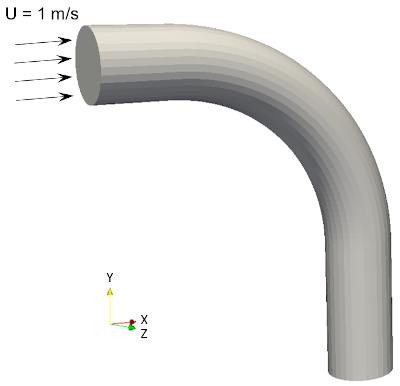
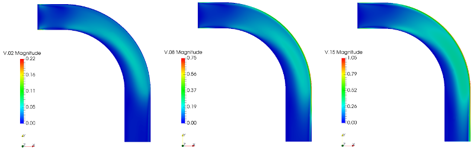
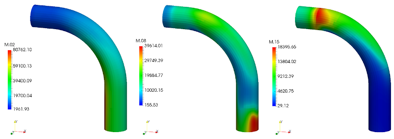

# Tutorial

_Navigation_

1. [About](Chap1_About.md)
2. [Model](Chap2_Model.md)
3. [Tutorial](Chap3_Tutorial.md)
4. [Cases](Chap4_Cases.md)
5. [Nomenclature](Chap5_Nomenclature.md)
6. [Classes](Chap6_Classes.md)
7. [References](Chap7_References.md)

## Overview

AeroSolved contains a number of cases which are there to illustrate and/or validate the functionality of the main components of AeroSolved. This page first presents the 'anatomy' of an AeroSolved case and, finally, an extensively described tutorial case.

## Anatomy of an AeroSolved case

An AeroSolved case consists of the following key configuration files:

* **constant/aerosolProperties**: this dictionary file is read by aerosolModel, and provides the configuration of the aerosolModel object. The key 'aerosolModel' provides the name of the aerosol model to be selected. The aerosolProperties dictionary file has the following sub-dictionaries:
    - diameter: provides a minimum (keyword 'min') and maximum (keyword 'max') 
    - &lt;aerosolModelName&gt;Coeffs: provides aerosol model-specific configuration
    - submodels: provides configuration to the sub-models. These are:
        + condensation
        + nucleation
        + coalescence
        + drift

* **constant/thermophysicalProperties**: configures the aerosolThermo object. It provides the following:
    - activeSpecies: a list of all active species
    - inactiveSpecies: a list of all inactive species
    - inertSpecie: the name of the inert species
    - phaseMixing: a dictionary with the phase mixing law for 'viscosity', 'conductivity' and 'heatCapacity'

* **constant/thermophysicalProperties.continuous** and **constant/thermophysicalProperties.dispersed**: provides the configuration of the continuous and dispersed phase thermo objects. It contains the following sub-dictionaries:
    - thermoType: specifies the thermo type of the phase thermo object
    - species: specifies a collection of dictionaries, each dictionary named after a species and containing the thermo-physical parameters for that species

## Tutorial cases

### Bent pipe particle deposition

`cases/bentPipe`

In this tutorial case, we study the deposition of aerosol droplets on the walls of a bent pipe. Due to the finite size of aerosol droplets, they have a small inertia which may causes their paths in a fluid flow to deviate from the streamlines of the flow itself. Curved streamlines may not be tracked exactly by the aerosol droplets and collision of the droplets with the domain walls may occur. Such collision of droplets can be the cause of actual deposition of the droplet on the walls, thereby effectively being taken out of the flow.

Depending on the flow conditions and the size distribution at the inlet of the bent pipe section a degree of deposition of the aerosol will take place. This can be simulated with the AeroSolved code, resolving the size distribution with a number of discrete size classes, referred to as sections. Moreover, the precise locations, where aerosol droplets of different sizes deposit can be inferred from such simulations.

#### Problem description

The three-dimensional computational domain consists of circular pipe of diameter $D$ = 10 mm, bent at an angle of 90 degrees, as shown in the Figure below. The flow enters the pipe horizontally from the inlet at the top-left, exiting the pipe vertically from the outlet at the bottom-right. The horizontal inlet section before the bend is of length equal to $D$, while the vertical outlet section after the bend is of length $2D$.

### Boundary conditions

The following boundary conditions apply:

* Inlet (left) with uniform velocity, $U$ = (1,0,0) m/s
* Outlet (bottom) with a fixed pressure, $p$ = 105 Pa
* No-slip walls
* zeroGradientDepositionVelocity (see [Classes](Chap6_Classes.md)) for the drift velocity
* zeroGradientAbsorbingWall (see [Classes](Chap6_Classes.md)) for the number concentration fields

### Running the case

A bash script (`Allrun`) is included in the bentPipe case which sets all the geometrical parameters, generates the mesh and runs the simulation using AeroSolved's main solver. The geometric and meshing parameters which can be modified are encoded in the script as below. It should be noted that in this tutorial case, although these parameters can be changed from this script, they are kept at the default value given below.

    R=5E-3          # Pipe radius [m]
    H=2E-3          # Bulk cell half-height [m]
    NR=10           # Number of cells over one radius
    DRWALL=1E-4     # Radial cell size at the wall [m]

The execution of the bash script requires two parameters as user input – the selections of the inertial drift model and the aerosol model. AeroSolved incorporates two inertial models to model drift velocities:

* fullStokes, for the complete Stokes model, and
* Manninen, for the reduced Stokes model (Manninen et al., 1996).

The aerosol model is selected by:

* moment, for the two-moment log-normal method, and
* sectional, for the sectional method.

For further details regarding these models, see [Model](Chap2_Model.md). In the present tutorial case, fullStokes is selected as the inertial model, while sectional is chosen as the aerosol model. By providing these parameters, the script is executed as below.

    ./Allrun fullStokes sectional

The bash script executes the blockMesh command which generates the computational domain and the mesh according to the provided parameters. The generated mesh is illustrated in the Figure below.

The thermophysical properties of the continuous phase are set as $\mu_c$ = 10-5 kg/(ms) and $\rho_c$ = 1 kg/m3, while the same properties for the dispersed phase are $\mu_d$ = 3.6&times;10-4 kg/(ms) and $\rho_d$ = 103 kg/m3. Sectional model is used for resolving the droplet distribution, with a total of 16 sections spanning from 10-13 kg to 10-10 kg (i.e., droplet diameters spanning roughly 10 - 34 μm). The main simulation parameters are defined in the files below.

`constant/aerosolProperties`

    aerosolModel    fixedSectional;
     
    diameter
    {
        min     1E-9;
        max     1E-3;
    }
     
    fixedSectionalCoeffs
    {
        distribution
        {
            type    list;
            y       (1.5806e-13 6.4836e-13 1.3242e-12 2.1439e-12 3.0855e-12 4.1349e-12 5.2820e-12 6.5191e-12 7.8400e-12 9.2398e-12 1.0714e-11 1.2260e-11 1.3873e-11 1.5551e-11 1.7293e-11 1.9094e-11 2.0955e-11);
            x       (4.0321e-13 9.8628e-13 1.7340e-12 2.6147e-12 3.6102e-12 4.7085e-12 5.9006e-12 7.1796e-12 8.5399e-12 9.9770e-12 1.1487e-11 1.3066e-11 1.4712e-11 1.6422e-11 1.8193e-11 2.0024e-11);
        }
      
        interpolation
        {
            type    twoMoment;
        }
      
        rescale     false;
       
        initFromPatch inlet;
    }
      
    submodels
    {
        condensation
        {
            type        none;
        }
         
        nucleation
        {
            type        none;
        }
         
        coalescence
        {
            type        none;
        }
         
        driftFluxModel
        {
            diffusion
            {
                type        none;
            }
         
            Brownian
            {
                type        StokesEinstein;
            }
         
            inertial
            {
                type        fullStokes;
                tolerance   1E-6;
                maxIter     3;
                VMax        10.0;
            }
        }
    }

The aerosol model parameters are defined here. The aerosol model is set to sectional method by using the keyword `fixedSectional`. Here, the size sections are defined by a list defined in `fixedSectionalCoeffs`.
Condensation, nucleation and coalescence of the particles are turned off. The drift velocity is modelled in two parts: by Brownian motion defined by the Stokes-Einstein model (`StokesEinstein`) and inertial drift defined by the complete Stokes model (`fullStokes`).

`0/M`

    dimensions      [-1 0 0 0 0 0 0];
     
    internalField   uniform 0.0;
     
    boundaryField
    {
        inlet
        {
            type        sectionalLogNormal;
            CMD         1E-6;
            sigma       4.0;
            value       $internalField;
        }
        
        outlet
        {
            type        inletOutlet;
            inletValue  $internalField;
            value       $internalField;
        }
        
        walls
        {
            type        zeroGradientAbsorbingWall;
            value       $internalField;
        }
    }

The boundary and initial condition for the number concentration `M` are defined here. Inlet condition is defined by a log-normal distribution with median `CMD` as 1 μm and distribution width `sigma` as 4. The `inletOutlet` condition at the wall sets the gradient at the outlet to zero, with the concentration clipped to zero in case of return flow. The wall boundary condition `zeroGradientAbsorbingWall` is derived from the *zero-gradient extrapolation model (ZGM)*, where the gradient of the number concentration is set to zero at the wall.

`0/V`

    dimensions      [0 1 -1 0 0 0 0];
        
    internalField   uniform (0 0 0);
        
    boundaryField
    {
        inlet
        {
            type        fixedValue;
            value       $internalField;
        }
        
        outlet
        {
            type        zeroGradient;
        }
        
        walls
        {
            type        zeroGradientDepositionVelocity;
            value       $internalField;
        }
    }

The boundary and initial condition for the droplet velocity `V` are defined here. The inlet condition is set as zero, while a condition of zero gradient is defined a the outlet. The wall boundary condition `zeroGradientDepositionVelocity` is derived from the *zero-gradient extrapolation model (ZGM)* where the velocity at the wall is set to the same positive velocity (towards the wall) as very close to the wall, while negative velocity (leading away from the wall) is clipped to zero.

After setting the parameters as described above, the bash script then runs the solver aerosolEulerFoam. Sampling routines have been incorporated in the controlDict file, which samples the flux of droplets of each size sections at the inlet and at the walls, at regular intervals. The simulation is performed for 1 second of flow time.

After the simulation has completed, the bash script then executes a python script for post-processing the summarized results (`plot.py`) and preparing a comparison plot. Deposition efficiency, $\eta$, is calculated for each droplet size section, from the droplet fluxes at the inlet and walls. Deposition efficiency is presented as a function of the particle Stokes number in the Figure below. Also presented for comparison are the experimental results of Pui et al. (1987), the analytical predictions of Cheng & Wang (1981), and the numerical data of Pilou et al. (2011).

Further analyses of the deposition of each droplet size section may be done by visualizing the drift velocity fields and droplet concentrations fields. The Figure below presents the drift velocities of three size sections (M.2, M.8 and M.15, corresponding with the second, eight and fifteenth section) on the cross-section of the bent pipe domain. The droplet number concentrations of these three size sections on the walls of the bent pipe are presented below.

