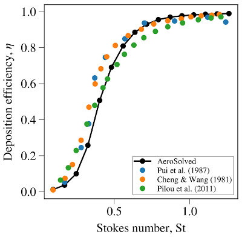
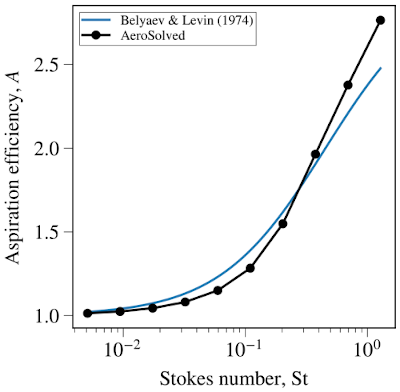
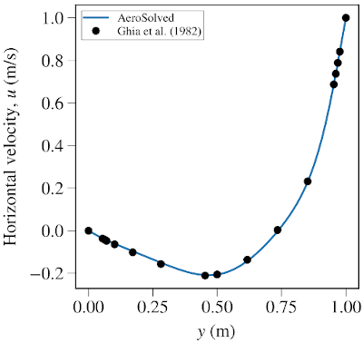
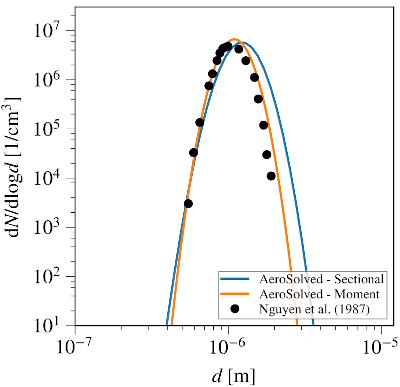
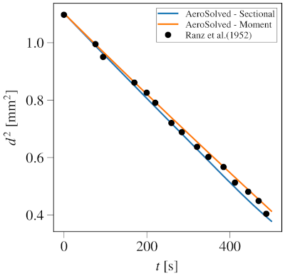
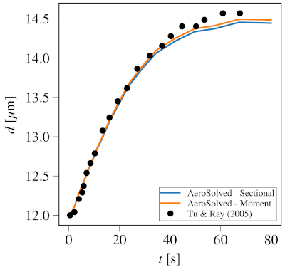
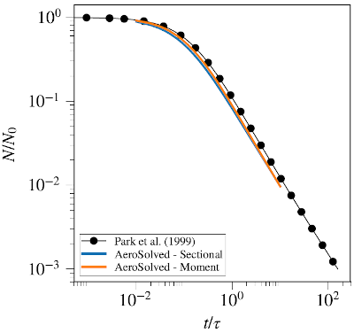
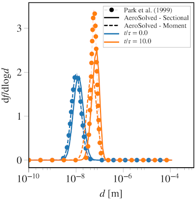

# Cases

_Navigation_

1. [About](Chap1_About.md)
2. [Model](Chap2_Model.md)
3. [Tutorial](Chap3_Tutorial.md)
4. [Cases](Chap4_Cases.md)
5. [Nomenclature](Chap5_Nomenclature.md)
6. [Classes](Chap6_Classes.md)
7. [References](Chap7_References.md)

## Overview

AeroSolved contains a number of cases for illustrating and/or validating the functionality of the main components of AeroSolved. This page presents the results for  several of these validation cases.

## Validation cases

### Bent pipe particle deposition

`cases/bentpipe`

The present validation case looks at the deposition of droplets on the walls of a bent pipe. Aerosol droplets deviate from the fluid streamlines and may collide with the domain walls leading to deposition. The drift velocity of the aerosol droplets, and thus the deposition, are governed by the size of the droplets. A three-dimensional pipe of diameter D = 10 mm, bent at an angle of 90 degrees is modelled. The aerosol, with an initial log-normal particle distribution, enters the pipe with a uniform velocity of 1 m/s.

Simulation is performed with AeroSolved using the sectional model with a total of 16 sections spanning from 10−13 kg to 10−10 kg, while the drift velocity is modelled by the complete Stokes model. The predicted droplet efficiencies of all droplet size sections are plotted as a function of Stokes number in the figure below. Also presented for comparison are the experimental results of [Pui et al. (1987)](https://doi.org/10.1080/02786828708959166), the analytical predictions of [Cheng & Wang (1981)](https://doi.org/10.1016/0004-6981(81)90032-9), and the numerical data of [Pilou et al. (2011)](https://doi.org/10.1080/02786826.2011.596171).

### Aerosol aspiration

`cases/aspiration`

This case serves as validation of drift modeling implemented in AeroSolved. Aerosol droplets deviate from the fluid streamlines due to droplet inertia introduced via an induced drift velocity. Aerosol aspiration is modeled inside an aerosol sampler that operates on a velocity different than the ambient velocity flow. The case may be characterized by a sampling velocity ratio $R$ which is defined as the sampling velocity over the ambient velocity. A semi-empirical model for aspiration efficiency (the ratio of that what is actually sampled over that what 'should have been' sampled if droplets would follow the streamlines) was presented by [Belyaev and Levin (1974)](https://doi.org/10.1016/0021-8502(74)90130-X).

A sampling velocity ratio of $R$ = 3 is modeled in an aerosol sampler, for a range of droplet sizes resulting from Stokes numbers St = 0.005 to 1.3.  Simulations are performed with AeroSolved using the sectional model with a total of 10 sections spanning 2&times;10−15 to 2&times;10−11 kg. The aspiration efficiency of droplets as a function of Stokes number is plot in the figure below, along with the predictions of Belyaev and Levin model.

### Lid-driven cavity flow

`cases/cavity`

This case serves as validation of the flow solver incorporated in AeroSolved. We look at a two-dimensional square cavity of unit side length with zero initial velocity. The top wall of the cavity is given a constant horizontal velocity of 1 m/s thereby driving the flow in the cavity. The side and bottom walls are modeled as stationery no-slip walls. The computational domain is meshed with (64 by 64) uniform cells. The density and viscosity of the continuous fluid are set as, $\rho$ = 1 kg/m3 and $\mu$ = 10-2 kg/(ms). The simulation is performed for 10 seconds of flow time, and velocity profiles are sampled along horizontal and vertical centerlines. The computed velocity profiles are presented below along with reference profiles of [Ghia et al. (1982)](https://doi.org/10.1016/0021-9991(82)90058-4).

 

### Laminar Flow Diffusion Chamber (LFDC)

`cases/LFDC`

The present validation case looks at aerosol formation in an LFDC, experimentally studied by [Nguyen et al. (1987)](https://doi.org/10.1016/0021-9797(87)90295-5). A pipe of length $L$ = 0.75 m and diameter $D$ = 1 cm is modeled using a two-dimensional wedge geometry, meshed with 32 and 1024 cells in the radial and axial directions, respectively. A flow containing air and a perfectly saturated dibutylphthalate (DBP) vapor is introduced at the inlet at a flow rate of, 1 l/min at 102 °C . The flow remains laminar throughout the domain. After a distance of 10 cm from the inlet, the pipe wall is cooled 21.4 °C. This lower wall temperature cools the air-DBP mixture such that the DBP eventually attains a sufficiently supersaturated state so that it can nucleate and condense into droplets. Thermophysical properties of the mixture are set the same as those experimentally investigated by [Nguyen et al. (1987)](https://doi.org/10.1016/0021-9797(87)90295-5).

Simulations are performed with AeroSolved using the moment model with $\sigma_g$ = 1.2, and using the sectional model with $P$ = 8 sections/mass decade, spanning 10^-25 to 10-10 kg. The predicted outlet droplet size distributions using both models is presented in the figure below, along with the experimental data from [Nguyen et al. (1987)](https://doi.org/10.1016/0021-9797(87)90295-5).

### Single droplet condensation and evaporation

`cases/singleDroplet/Ranz` and `cases/singleDroplet/TuAndRay`

In these validation cases, we look at condensation and evaporation of single droplets. First we look at a single water droplet suspended in dry atmosphere at 8.85 °C. Because of the non-zero saturation pressure of water, the droplet loses mass due to evaporation, and slowly shrinks in size. The size of the droplet was experimentally measured by Ranz & Marshall (1952). A single droplet with an initial diameter of 1.05 mm is modeled in a one-cell domain. Thermophysical properties of the mixture are taken from Perry & Green (1997). Simulations are performed with AeroSolved using the moment model with $\sigma_g$ = 1.0001, and using the sectional model with $P$ = 16 spanning 10−12 to 10−5 kg. The square of the diameter is plotted from both simulations and compared against the experimental data of Ranz & Marshall (1952) as shown below.

Next, we look at a single droplet suspended in wet atmosphere at 25 °C. The droplet initially consists of only glycerol (VG), and water vapor is gradually introduced at the walls of the volume. This water vapor condenses onto the droplet, which causes the droplet to grow in size. Activity coefficients of the different species are taken from [Zhang et al. (2012)](https://doi.org/10.1016/j.jaerosci.2011.12.002). A single droplet is modeled with an initial diameter of 12 μm in a one-cell domain. Thermophysical properties of the mixture are taken from Perry & Green (1997) and VDI (2010). Simulations are performed with AeroSolved using the moment model with $\sigma_g$ = 1.0001, and using the sectional model with $P$ = 32 sections/mass decade spanning 10−13 to 10−10 kg. The increase in droplet diameter is plotted from both simulations and compared against the experimental data of [Tu & Ray (2005)](https://doi.org/10.1080/00986440590477845) as below.

### Aerosol coalescence

`cases/uniformCoalescence`

This case validates the coalescence kernels implemented in AeroSolved against the analytical coalescence model of [Park et al. (1999)](https://doi.org/10.1016/S0021-8502(98)00037-8). We look at coalescence of a uniform aerosol with known initial distribution. As time advances, the total number concentration decays and the size distribution ‘shifts to the right’ in the size domain. The time scale of the problem is $\tau=1/(KN_0)$ with $N_0$ the initial particle number concentration. An aerosol with initial count-median diameter of 10 nm is modeled in a single-cell domain. The decay of the number concentration as a function of time is plot from both simulations against the analytical data of [Park et al. (1999)](https://doi.org/10.1016/S0021-8502(98)00037-8) in the first Figure below. The second Figure below shows the evolution of size distribution subject to coalescence from both simulations and compared against the analytical data of [Park et al. (1999)](https://doi.org/10.1016/S0021-8502(98)00037-8).

## Illustration cases

### Brownian diffusion

`cases/Brownian`

A simple one-dimensional domain is used to test Brownian diffusion. Particles enter on one side of the domain, and diffuses towards the other side.

### Capillary Aerosol Generator (CAG)

`cases/CAG`

In this case, aerosol formation due to nucleation and aerosol growth due to condensation is modeled inside a CAG.

### Two-dimensional channel flow

`cases/channel`

In a two-dimensional domain, turbulent channel flow is simulated. The turbulence is captured using OpenFOAM's standard k-epsilon model.

### Vapor diffusion

`cases/diffusion`

A simple one-dimensional domain is used to test vapor diffusion. Vapor enters on one side of the domain, and diffuses towards the other side.

### Aerosol deposition in an elbow

`cases/elbow`

This case contains a two-dimensional square elbow geometry. Due to the curvature in the flow, aerosol deposits on the wall. The case can be used to quickly test the inertial drift flux modeling.

### Unsteady flow past a square cylinder

`cases/squareCylinder`

In order to test the temporal accuracy of AeroSolved, this case simulates the unsteady flow past a square cylinder.

### Mixing tee deposition

`cases/tee`

In order to test the sub-grid deposition velocity model, this cases simulates deposition of particles onto a wall in a tee-section. Only half of the tee-section is modeled. The cut plane is captured using a symmetry boundary condition.

### Spatially uniform droplet nucleation and growth

`cases/uniformNucleation`

In this case, a zero-dimensional nucleation and condensational growth problem is solved. Initially, a vapor mixture is at equilibrium. Then, the temperature in slowly decreased. This causes a supersaturation of the vapors, and a subsequent nucleation and condensational growth. The case can be used to quickly test the nucleation and condensation model implementations.

### Spatially uniform droplet evaporation

`cases/uniformEvaporation`

Similar to the uniformNucleation case, but with a final temperature increase, leading to evaporation.

